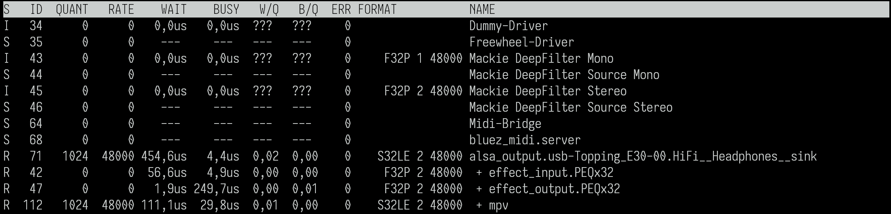
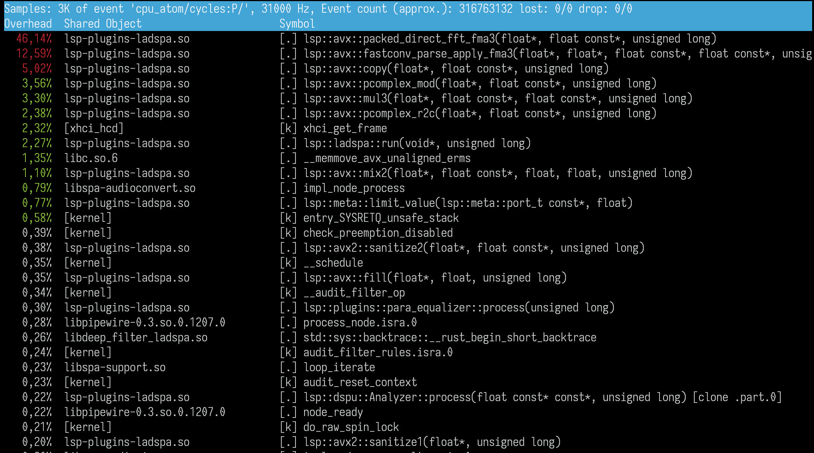

# peqwire

`peqwire.py`
Read EasyEffects PEQ parameter file and output pipewire libpipewire-module-filter-chain
configuration using LSP plugin "http://lsp-plug.in/plugins/ladspa/para_equalizer_x32_lr".

## Screenshot

## Bugs
Probably too many to count

